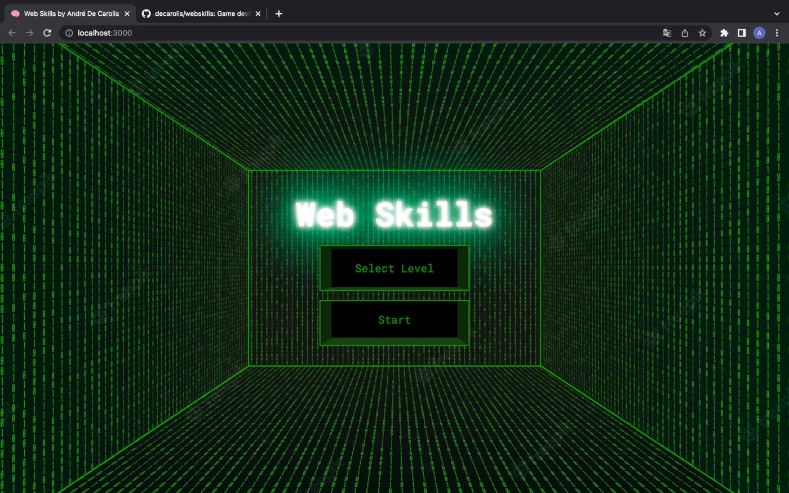
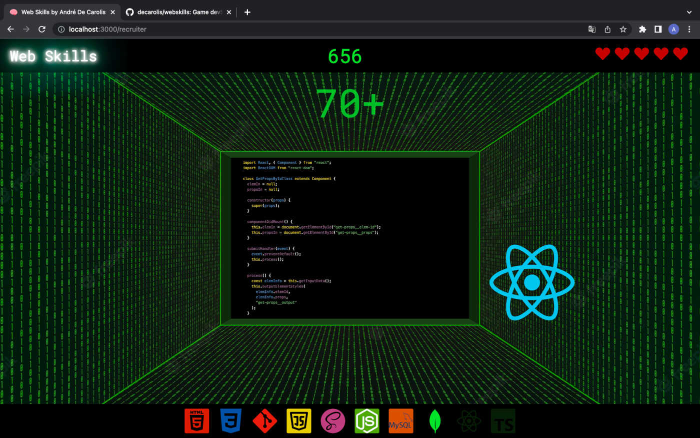
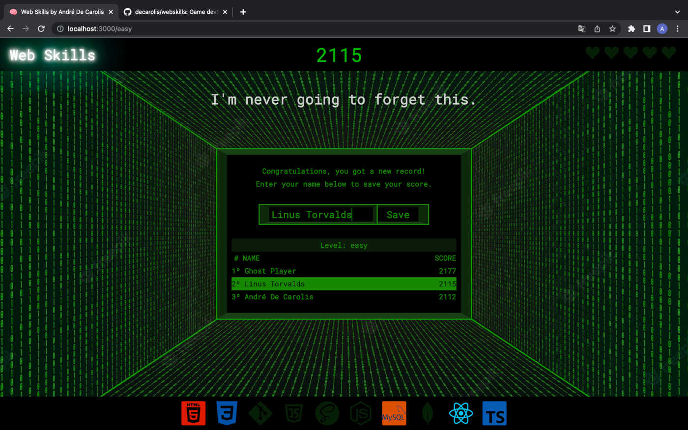

# WebSkills

ReactJS application that uses Create-React-App and the React-icons library.

It's a game that tries to reflect in a playful way the beginning of a web developer's professional journey. Images of web-related technologies appear on the screen randomly and you need to click on them to score points. Highscores are saved locally using the client browser's localStorage.

I hope you guys have fun!!!

https://webskills.netlify.app/





## 🚀 Starting

These instructions will allow you to make a working copy of the project on your local machine for development and testing purposes.

### 📋 Prerequisites

What things do you need to install the software?

```
node.js ^12
```

### 🔧 Installation

Make a clone of this repository and install it in your development environment using the following command in your terminal (choose an appropriate directory):

```
git clone https://github.com/decarolis/webskills.git

```

After cloning the repository content, access the created directory and install the dependencies:

```
cd WebSkills

npm install
```

After this installation, run the application with the npm start command. The application will be available at http://localhost:3000.

## 🛠️ built with

- [React: 18.2.0]
- [React-dom: 18.2.0]
- [React-icons: 4.4.0]
- [React-router-dom: 6.3.0]

## 📄 License

This project is under the MIT License

---

⌨️ with ❤️ by [André De Carolis](https://github.com/decarolis) 😊
